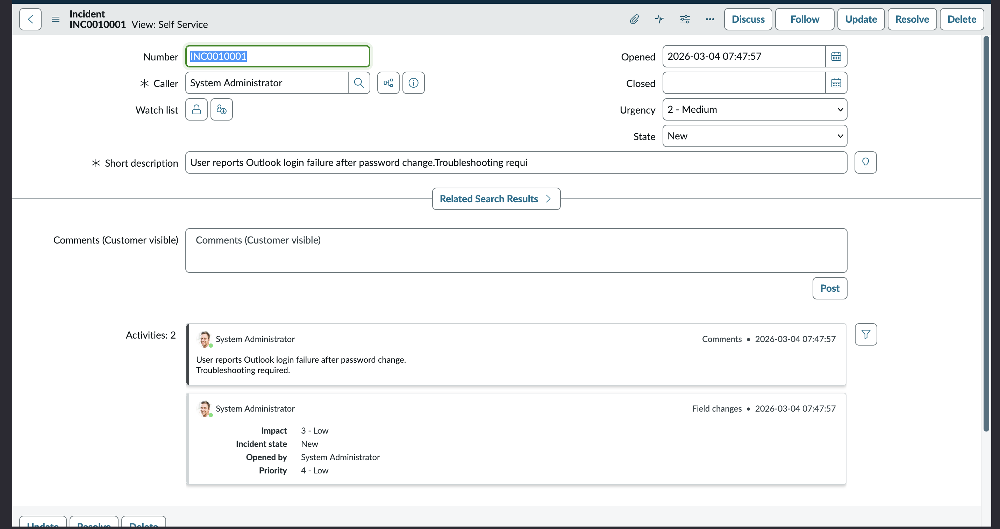
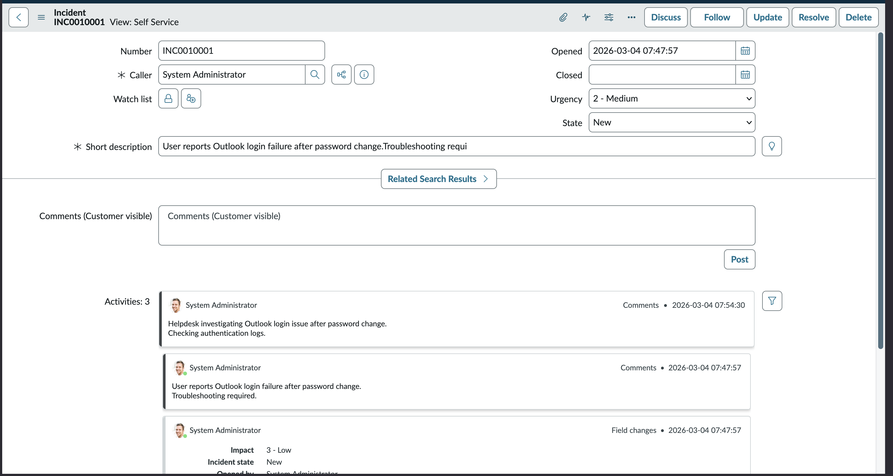
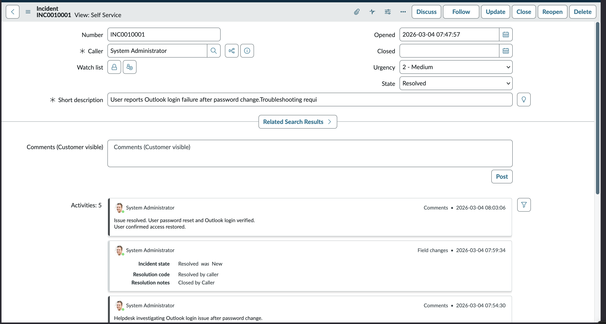

# ServiceNow Helpdesk Incident Workflow Lab

## Overview

This lab demonstrates a basic Tier-1 helpdesk incident workflow using ServiceNow.

The goal is to simulate the lifecycle of a helpdesk ticket from creation to resolution.

## Environment

ServiceNow Developer Instance  
ServiceNow Incident Management

## Incident Scenario

User reports Outlook login failure after a password change.

Helpdesk must investigate and restore access.

---

## 1. Incident Creation

A new incident was created in ServiceNow to report the issue.

Screenshot:

---

## 2. Investigation / Work Notes

The helpdesk technician added notes indicating investigation of authentication logs.

Screenshot:

---

## 3. Incident Resolution

The issue was resolved after resetting the user's password and verifying Outlook login access.

Screenshot:

---

## Skills Demonstrated

- ServiceNow Incident Management
- Helpdesk ticket lifecycle
- Incident investigation
- Work notes documentation
- Incident resolution workflow
